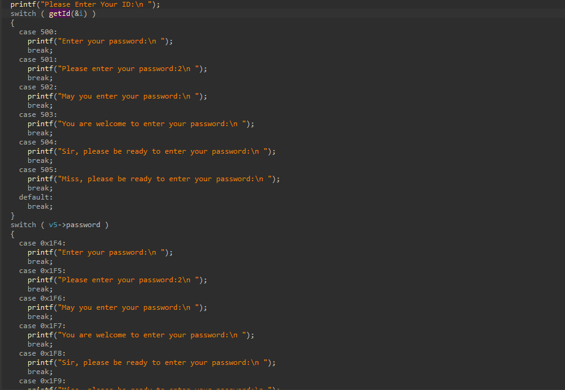

# EnumHim

EnumHim is a plugin for declaring an enum from a decompiled switch statement

## Installation
put EnumHim.py at your plugins directory

## Usage
Press SHIFT+M when your cursor is on the line of the switch statement
an enum will be generated from all of the cases

The plugin is architectue agnostic, because it is based upon the decompiler output

An enum can be generated when the expression in the switch statement is one of the following,

* struct->member
* struct.member
* local_variable
* func()

And the type of the expression is changed to the enum accordingly

More complex expression can't be easily resolved into an enum so they weren't implemented

## Example

## License
[MIT](https://choosealicense.com/licenses/mit/)
